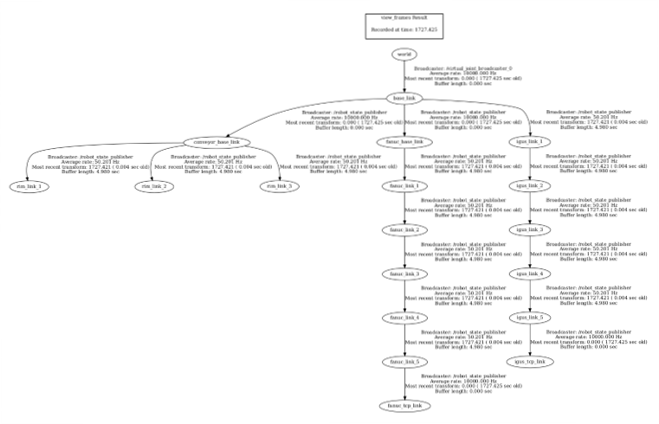
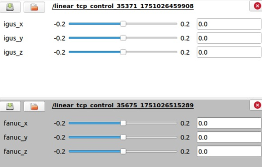

# Dual Robot Industrial Simulation

This project implements a dual-robot industrial simulation using ROS.
Two custom robot models with individual kinematics interact in a shared
industrial task within a simulated environment.

The project includes robot modeling, simulation, and a simple
Human-Machine Interface (HMI) for controlling robot motion.

## Rendered 3D-models

{ width=50% }

## Coordinate Frames



## Human Machine Interface




Features
- Custom robot kinematics and URDF models
- Simulation of two interacting robots
- Industrial task scenario
- Inverse kinematics for TCP motion
- Human-Machine Interface for robot control
- Launch scripts to start the simulation

## ROD Project Setup

This repository contains the description packages for the **ROD project**.
It is designed to run in a **ROS environment (e.g. ROS Noetic)**.

Note: If something is missing in this README, please add it. (@Sameh)

---

## 🔑 Setup SSH Access (recommended)

If you want to clone the repository via **SSH instead of HTTPS**, first create an SSH key.

### 1. Generate SSH key (if you don't already have one)

```bash
ssh-keygen -t ed25519 -C "your.email@example.com"
```

### 2. Show and copy your public key

```bash
cat ~/.ssh/id_ed25519.pub
```

### 3. Add the SSH key to GitHub

Open:

```
https://github.com/settings/keys
```

Then:

- Click **New SSH Key**
- Paste the copied key
- Give the key a name

### 4. Test SSH connection

```bash
ssh -T git@github.com
```

---

## 📥 Clone the repository

```bash
git clone git@github.com:karim0101-droid/ROD_Project.git
```

Note: Make sure SSH access is configured.

---

## 🌿 Work in your branch

Switch to your branch:

```bash
git checkout branch-name
```

If you don't have a branch yet, create one:

```bash
git checkout -b new-branch-name
```

---

## 📦 Install dependencies

### 1. Install missing ROS controllers

```bash
sudo apt install ros-noetic-ros-controllers
```

This package includes:

- JointTrajectoryController
- additional controller plugins

### 2. Check available controller plugins

```bash
rosservice call /controller_manager/list_controller_types
```

### 3. Install MoveIt

```bash
sudo apt install ros-noetic-moveit*
```

---

## ⚙️ Setup and build the workspace

```bash
cd ~/GRUPPE07_Arafa_El-Harery
catkin init
catkin build
```

---

## 📡 Automatically source the workspace

Open `.bashrc`:

```bash
nano ~/.bashrc
```

Add the following line:

```bash
source ~/GRUPPE07_Arafa_El-Harery/devel/setup.bash
```

If this does not work, specify the full path.

Save and exit:

```
CTRL + X → Y → Enter
```

Reload the configuration:

```bash
source ~/.bashrc
```
